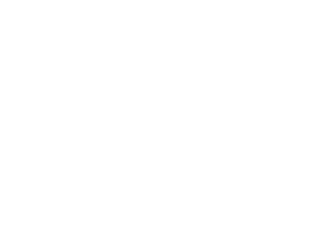

# **WiDS Datathon++ 2025 University Challenge**

### Analiza literaturii de specialitate
| Nr. | Autori/An | Titlul articolului/proiectului | Aplicatie/Domeniu | Tehnologii utilizate | Metodologie/Abordare | Rezultate | Limitari | Comentarii suplimentare | 
| :--- | :--- | :--- | :--- | :--- | :--- | :--- | :--- | :--- |
| 1. | L.K. Soumya Kumari, R. Sundarrajan / 2024 | A review on brain age prediction models | Brain age prediction, Deep learning | Mai multe tehnici de predictie utilizate in ultimii 11 ani pentru estimarea varstei creierului | Comparatie intre diverse tehnici si modele (SVR, CNNs, RNNs, combinatii de modele) | Cel mai bun rezultat obtinut pe fMRI-uri: SVR (Support Vector Regression)  MAE = 0.753 years |   | Un model de regresie eficient pentru datele proiectului nostru este SVR |
| 2. | Hongfang Han, Sheng Ge, Haixian Wang / 2023 | Prediction of brain age based on the community structure of functional networks | Brain age prediction | MATLAB | S-au testat 6 modele de machine learning diferite (SVR, RVR, LASSO, EN, RR, XGBoost) pentru predictia varstei | SVR MAE = 0.753 years | S-a folosit un numar mic de date, dintre care una singura pentru verificarea acuratetei finale |   |
| 3. | Siamak K. Sorooshyari / 2024 | Beyond network connectivity: A classification approach to brain age prediction with resting-state fMRI | Brain age/sex prediction | MATLAB, FMRIB Software Library | S-au utilizat fMRI-uri de la 887 de indivizi cu varste intre 21-85 ani, esantionate cu ajutorul metodei Monte-Carlo, pentru antrenarea unui SVM. Scopul a fost observarea acuratetei pentru categorii de varsta si diferentierea intre sexe. | S-a observat ca diferentele intre sexe se diminueaza odata cu cresterea in varsta devenind minime intre 61 si 70 de ani. S-a constatat ca nu se poate realiza o predictie a sexului individului. | Nu s-au realizat optimizari asupra spatiului de date | Avand in vedere ca datele primite pentru proiectul nostru consista in indivizi cu varste intre 5-22 ani, vom lua in considerare o esantionare pe sexe pentru o acuratete sporita |
| 4. | Pedro F. Da Costa, Jessica Dafflon, Walter H. L. Pinaya / 2020 | Brain-Age Prediction Using Shallow Machine Learning: Predictive Analytics Competition 2019 | Brain age prediction | Python | S-au testat diverse modele (LR, SVR, GPR, Decision Trees) pe un set de date de 2,640 participanti. S-a folosit un ansamblu de modele de predictie pentru varianta finala. | S-a obtinut pentru SVR combinat cu date despre materia cenusie si cea alba:  MAE = 4.571 | Nu s-au luat in considerare modelele pentru care MAE>7 |   |
| 5. | Hedieh Sajedi, Nastaran Pardakhti / 2019 | Age Prediction Based on Brain MRI Image: A Survey | Brain age prediction, Brain MRI | Mai multe tehnici de predictie a varstei | Sunt analizate diverse tipuri de metode de procesare a imaginilor (pixel-based, voxel-based si surface-based) si diverse modele de predictie de Machine Learning (SVR, GPR) si Deep Learning (CNN) | SVM Voxel based:  Accuracy = 96.25%   MAE = 5.08    Using small kernel size  GR = 97.6%  SS = 100%  SC = 95.8% | Costuri computationale ridicate, senzitivitate la calitatea imaginilor |   |

### Arhitectura propusa

